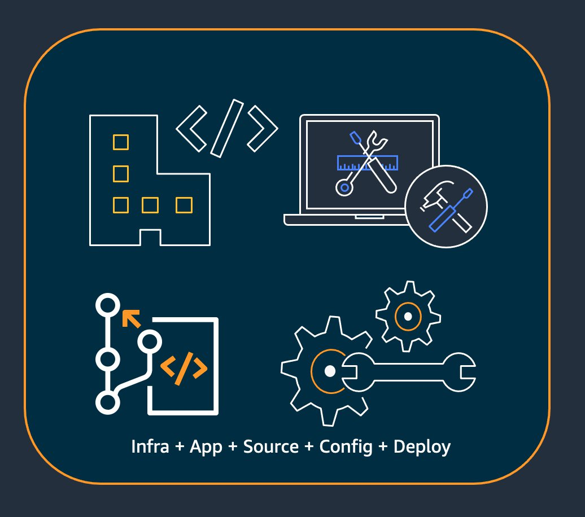
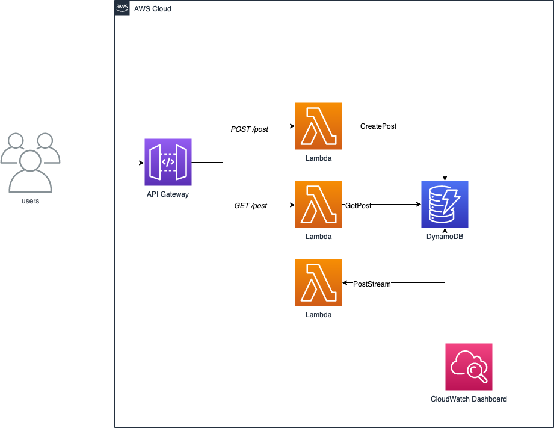
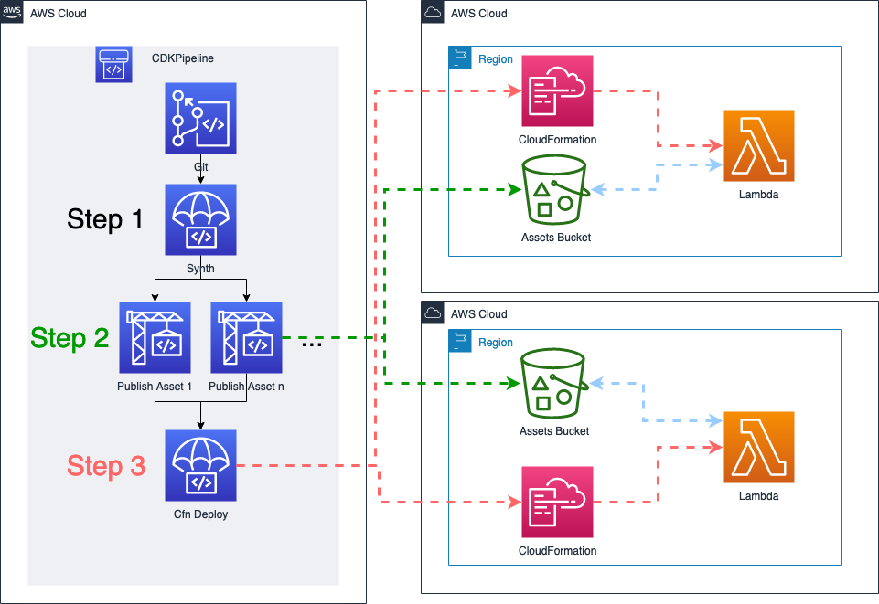

## Intro

In this post we will discuss how the [AWS Cloud Development
Kit](https://docs.aws.amazon.com/cdk/latest/guide/home.html) (AWS CDK) enables
developers to manage application code and infrastructure code together in the
same project, using the same programming language, and utilizing the same
deployment pipeline. The AWS CDK allows developers to define their
infrastructure using a familiar programming language, such as TypeScript,
Python, Java, or Go. In a [previous
post](https://aws.amazon.com/blogs/devops/best-practices-for-developing-cloud-applications-with-aws-cdk/)
we walked through best practices for developing cloud applications with the AWS
CDK, one of which was organizing infrastructure code and application code in the
same package. In [another
post](https://aws.amazon.com/blogs/devops/building-apps-with-aws-cdk/) we showed
how you can take advantage of the powerful asset bundling functionality that can
handle the deployment of resources like Lambda code bundles and Docker images.

In this post we will take this further and show you what it looks like to build
and deploy a Go application using the AWS CDK for Go. We will show the benefits
of writing your infrastructure and application in Go within the same project,
enabling capabilities such as:

* Centrally managing dependencies
* Creating reusable packages for composing infrastructure
* Configuring your application deployment
* Running unit tests across application and infrastructure code




## Use Case

To illustrate the concepts in this blog post we are going to use an example
backend application for a blog written in Go. We will use DynamoDB to store data
on each blog post and use API Gateway and Lambda to get, update, and delete data
from the DynamoDB table. The architecture for this application is shown in the
architecture diagram below.




Stepping through this architecture, users will send requests to the API Gateway
endpoint (most likely via a front-end application) either to create a new blog
post or return an existing blog post. Each of these actions has its own Lambda
function which allows us to take advantage of API Gateway's native routing
functionality. We also want to be able to easily return the total number of blog
posts without having to scan all the data in the table. To accomplish this we
will use DynamoDB streams to update an item in the table with the total number
of posts whenever a post is created or deleted. Finally we want to create a
CloudWatch dashboard so we can monitor the health of our application.


### Creating our project

The following tutorial uses Go, and requires version 1.16 or later. You will
also need version 1.11.0 or later of the AWS CDK.

The first thing we will do is create our project using the CDK init command.


```console
$ mkdir cdk-go-app && cd cdk-go-app
$ cdk init --language=go app
```


This will generate a project structure that looks like this.


```tree
.
├── README.md
├── cdk-go-app.go
├── cdk-go-app_test.go
├── cdk.json
└── go.mod
```


Next let’s `go get` all of the dependencies we will use in this project. You'll
notice that we are getting *all* of our dependencies, both those needed for our
Lambda application, as well as those needed for our infrastructure. We are able
to manage all of our dependencies for both our application and infrastructure
together as part of a single Go application because when we build each of our
Lambda applications, Go will only include packages named by the import paths.


```console
$ go get github.com/aws/aws-cdk-go/awscdk/awslambdago github.com/aws/aws-cdk-go/awscdk github.com/aws/aws-lambda-go github.com/aws/aws-sdk-go-v2 github.com/aws/aws-sdk-go-v2/config github.com/aws/aws-sdk-go-v2/feature/dynamodb/attributevalue github.com/aws/aws-sdk-go-v2/feature/dynamodb/expression github.com/aws/aws-sdk-go-v2/service/dynamodb github.com/kelseyhightower/envconfig github.com/pkg/errors
```

### Create our stage

Next we will begin creating the initial infrastructure for our application. We
will create an internal package that will host our CDK code. Create a new file
`stage.go` which we will use to create our application
[stage](https://docs.aws.amazon.com/cdk/api/latest/docs/@aws-cdk_core.Stage.html).
A CDK `Stage` is an abstraction that describes a single logical, cohesive
deployable unit of your application. Within a Stage we will define all of our
[Stacks](https://docs.aws.amazon.com/cdk/latest/guide/stacks.html) which should
be deployed together. Once we define our stage, we can then instantiate our
stage multiple times to model multiple copies of our application which could be
deployed to different environments.


```console
$ mkdir -p internal/pkg/cdk && touch internal/pkg/cdk/stage.go
```

*[internal/pkg/cdk/stage.go](https://github.com/aws-samples/cdk-app-example-go/blob/main/internal/pkg/cdk/stage.go)*

```go
package cdk

import (
    "github.com/aws/aws-cdk-go/awscdk"
)

func NewStage(scope awscdk.Construct, id string, props awscdk.StageProps) awscdk.Stage {
        stage := awscdk.NewStage(scope, &id, &props)

        return stage
}

```

In the above code we create a function `NewStage` which will create and return a
CDK Stage. Now let's model out our application using CDK Stacks as the unit of
deployment.


```go
package cdk

import (
    "github.com/aws/aws-cdk-go/awscdk"
    "github.com/aws/jsii-runtime-go"
)

func NewStage(scope awscdk.Construct, id string, props awscdk.StageProps) awscdk.Stage {
  ...

        //-------------------------------------------------------------------------//
        //-----------------------------Monitor Stack-------------------------------//
        //-------------------------------------------------------------------------//

        monitorStack := awscdk.NewStack(stage, jsii.String("MonitorStack"), &awscdk.StackProps{})


        //-------------------------------------------------------------------------//
        //-------------------------Datatstore Stack--------------------------------//
        //-------------------------------------------------------------------------//

        datastoreStack := awscdk.NewStack(stage, jsii.String("DatastoreStack"), &awscdk.StackProps{
                TerminationProtection: jsii.Bool(true),
        })

        //-------------------------------------------------------------------------//
        //-----------------------------Api Stack-----------------------------------//
        //-------------------------------------------------------------------------//

        apiStack := awscdk.NewStack(stage, jsii.String("APIStack"), &awscdk.StackProps{})

        return stage
}
```


When modeling your CDK application into Stacks, you want to split resources into
stacks based on deployment properties. For our application, we have split out
our resources into three stacks.


1. `Datastore Stack`: This stack will host our stateful resources like our
   DynamoDB table. These are resources that are stateful and not expected to be
   deleted/recreated, so we can enable termination protection on this stack.
2. `API Stack`: This stack will host our API Gateway, as well as our Lambda
   Functions.
3. `Monitor Stack`: This stack will host our monitoring dashboard and widgets.
   Since the monitoring dashboard will depend on metrics from both the
   `Datastore` stack and the `API` stack, we separate this out into its own
   stack.

[Image: Go Blog(1).png](images/Go_Blog-Page-2.png)
Now that we’ve modeled out our stage, let's start adding our resources. First we
will add our DynamoDB table to our `Datastore` stack.


```go
package cdk

import (
    "github.com/aws/aws-cdk-go/awscdk"
    "github.com/aws/aws-cdk-go/awsdynamodb"
    "github.com/aws/jsii-runtime-go"
)
...

//-------------------------------------------------------------------------//
//-------------------------Datatstore Stack--------------------------------//
//-------------------------------------------------------------------------//

datastoreStack := awscdk.NewStack(stage, jsii.String("DatastoreStack"), &awscdk.StackProps{
        TerminationProtection: jsii.Bool(true),
})

table := awsdynamodb.NewTable(dynamodbStack, jsii.String("PostDatastore"),  &awsdynamodb.TableProps{
    PartitionKey:  &awsdynamodb.Attribute{
        Name: jsii.String("pk"),
        Type: awsdynamodb.AttributeType_STRING,
    },
    Encryption: awsdynamodb.TableEncryption_AWS_MANAGED,
    BillingMode: awsdynamodb.BillingMode_PAY_PER_REQUEST,
    Stream: awsdynamodb.StreamViewType_NEW_AND_OLD_IMAGES,
})

...
```


And then add our HTTP API Gateway to our API stack.


```go
package cdk

import (
    "github.com/aws/aws-cdk-go/awscdk"
    "github.com/aws/aws-cdk-go/awsapigatewayv2"
    "github.com/aws/aws-cdk-go/awscloudwatch"
    "github.com/aws/aws-cdk-go/awsdynamodb"
    "github.com/aws/aws-cdk-go/awslambda"
    "github.com/aws/jsii-runtime-go"
)

...
//-------------------------------------------------------------------------//
//-----------------------------Api Stack-----------------------------------//
//-------------------------------------------------------------------------//

apiStack := awscdk.NewStack(stage, jsii.String("APIStack"), &awscdk.StackProps{})
api := awsapigatewayv2.NewHttpApi(apiStack, jsii.String("Api"),  &awsapigatewayv2.HttpApiProps{})

...

```

### Add Monitoring

For our monitoring stack we want it to be easy to add new metrics to our
application dashboard, so we are going to create an internal construct package
that will create our dashboard and provide utility methods for easily adding new
metrics.


```console
$ mkdir -p internal/pkg/cdk/constructs && touch internal/pkg/cdk/constructs/monitor.go
```

*[internal/pkg/cdk/constructs/monitor.go](https://github.com/aws-samples/cdk-app-example-go/blob/main/internal/pkg/cdk/constructs/monitor.go)*

```go
package constructs

import (
    "github.com/aws/aws-cdk-go/awscdk"
    "github.com/aws/aws-cdk-go/awsapigatewayv2"
    "github.com/aws/aws-cdk-go/awscloudwatch"
    "github.com/aws/aws-cdk-go/awsdynamodb"
    "github.com/aws/aws-cdk-go/awslambda"
    "github.com/aws/jsii-runtime-go"
)

type MonitorProps struct {
        DashboardName string
}

type IMonitor interface {
        awscloudwatch.Dashboard
        MonitorLambdaFunction(function awslambda.IFunction)
        MonitorDynamoDBTable(table awsdynamodb.ITable)
        MonitorHttpApi(api awsapigatewayv2.HttpApi)
}

type Monitor struct {
        awscloudwatch.Dashboard
}

func NewMonitor(scope awscdk.Construct, id string, props MonitorProps) IMonitor {
        s := awscdk.NewConstruct(scope, &id)

        dash := awscloudwatch.NewDashboard(s, jsii.String("Dashboard"), &awscloudwatch.DashboardProps{
                DashboardName: &props.DashboardName,
        })

        return &Monitor{
                dash,
        }

}
```


In the above code we have created a new construct that creates a CloudWatch
Dashboard and returns the `IMonitor` interface. An
[interface](https://gobyexample.com/interfaces) in Go is a named collection of
method signatures. In our case we are going to add a couple of methods which
will allow us to easily add common Lambda, DynamoDB, and API Gateway metrics to
our dashboard.

Lets add the first method `MonitorDynamoDBTable` for easily adding relevant
DynamoDB metrics to our dashboard.


```go
package constructs

import (
    "github.com/aws/aws-cdk-go/awscdk"
    "github.com/aws/aws-cdk-go/awsapigatewayv2"
    "github.com/aws/aws-cdk-go/awscloudwatch"
    "github.com/aws/aws-cdk-go/awsdynamodb"
    "github.com/aws/aws-cdk-go/awslambda"
    "github.com/aws/jsii-runtime-go"
)

...

func (m *Monitor) MonitorDynamoDBTable(table awsdynamodb.ITable) {
        readMetric := awscloudwatch.NewMetric(&awscloudwatch.MetricProps{
                Dimensions: &map[string]interface{}{
                        "TableName": table.TableName(),
                },
                Statistic:  jsii.String("sum"),
                Period:     awscdk.Duration_Minutes(jsii.Number(1)),
                Namespace:  jsii.String("AWS/DynamoDB"),
                MetricName: jsii.String("ConsumedReadCapacityUnits"),
                Label:      jsii.String("Consumed (Read)"),
        })

        writeMetric := awscloudwatch.NewMetric(&awscloudwatch.MetricProps{
                Dimensions: &map[string]interface{}{
                        "TableName": table.TableName(),
                },
                Statistic:  jsii.String("sum"),
                Period:     awscdk.Duration_Minutes(jsii.Number(1)),
                Namespace:  jsii.String("AWS/DynamoDB"),
                MetricName: jsii.String("ConsumedWriteCapacityUnits"),
                Label:      jsii.String("Consumed (Write)"),
        })

        m.AddWidgets(
                awscloudwatch.NewGraphWidget(&awscloudwatch.GraphWidgetProps{
                        Title:   jsii.String("Read Capacity Units/1min"),
                        Width:   jsii.Number(12),
                        Stacked: jsii.Bool(true),
                        Left:    &[]awscloudwatch.IMetric{readMetric},
                }),
                awscloudwatch.NewGraphWidget(&awscloudwatch.GraphWidgetProps{
                        Title:   jsii.String("Write Capacity Units/1min"),
                        Width:   jsii.Number(12),
                        Stacked: jsii.Bool(true),
                        Left:    &[]awscloudwatch.IMetric{writeMetric},
                }),
        )
}
```


Here we want to track two metrics, one for `ConsumedWriteCapacityUnits` and the
second for `ConsumedReadCapacityUnits`. We create a CloudWatch metric for each
and then add widgets to our dashboard to display each. If you want to see the
code for the other two methods (`MonitorLambdaFunction` and `MonitorHttpApi`)
you can view the code [here]().

Now whenever we want to add these metrics for a particular DynamoDB table, all
we have to do is call this method. Let’s do that now. First we will create our
dashboard in our Monitor stack.


```go
package cdk

import (
    "github.com/aws/aws-cdk-go/awscdk"
    "github.com/aws/aws-cdk-go/awsapigatewayv2"
    "github.com/aws/aws-cdk-go/awscloudwatch"
    "github.com/aws/aws-cdk-go/awsdynamodb"
    "github.com/aws/aws-cdk-go/awslambda"
    "github.com/aws/jsii-runtime-go"
    createpost "github.com/corymhall/cdk-blog-post-code/internal/app/createpost/cdk"
    poststream "github.com/corymhall/cdk-blog-post-code/internal/app/poststream/cdk"
    "github.com/corymhall/cdk-blog-post-code/internal/pkg/cdk/constructs"
)

...

//-------------------------------------------------------------------------//
//-----------------------------Monitor Stack-------------------------------//
//-------------------------------------------------------------------------//

monitorStack := awscdk.NewStack(stage, jsii.String("MonitorStack"), &awscdk.StackProps{})
monitor := constructs.NewMonitor(monitorStack, "Monitor", constructs.MonitorProps{
        DashboardName: "PostStore-Dashboard",
})

...
```


Then we will use the `MonitorDynamoDBTable` method to add widgets tracking
metrics for our `Datastore` table.


```go
package cdk

import (
    "github.com/aws/aws-cdk-go/awscdk"
    "github.com/aws/aws-cdk-go/awsapigatewayv2"
    "github.com/aws/aws-cdk-go/awscloudwatch"
    "github.com/aws/aws-cdk-go/awsdynamodb"
    "github.com/aws/aws-cdk-go/awslambda"
    "github.com/aws/jsii-runtime-go"
    createpost "github.com/corymhall/cdk-blog-post-code/internal/app/createpost/cdk"
    poststream "github.com/corymhall/cdk-blog-post-code/internal/app/poststream/cdk"
    "github.com/corymhall/cdk-blog-post-code/internal/pkg/cdk/constructs"
)

...
//-------------------------------------------------------------------------//
//-------------------------Datatstore Stack--------------------------------//
//-------------------------------------------------------------------------//

...

table := awsdynamodb.NewTable(dynamodbStack, jsii.String("PostDatastore"), &awsdynamodb.TableProps{
        ...
})

monitor.MonitorDynamoDBTable(table)

...
```


Since we have created this monitor construct as it’s own construct package, it
would be easy enough to extract it out into it’s own separate package. We could
create a standard monitoring package that any team within our organization could
use to easily add monitoring to any of their applications without having to
reinvent the wheel each time.

### Create our Lambda functions

Now that we've created our base infrastructure, let's create our first Lambda
function, createPost. Create a new `main.go` file located at
`cmd/createPost/main.go`.


```console
$ mkdir -p cmd/createpost && touch cmd/createpost/main.go
```


In this file we will create the handler for our Lambda function.

*[cmd/createpost/main.go](https://github.com/aws-samples/cdk-app-example-go/blob/main/cmd/createpost/main.go)*

```go
package main

import (
    "context"
    "encoding/json"
    "log"
    
    "github.com/aws/aws-lambda-go/events"
    "github.com/aws/aws-lambda-go/lambda"
    
    "github.com/aws/aws-sdk-go-v2/config"
    "github.com/aws/aws-sdk-go-v2/service/dynamodb"
    "github.com/corymhall/cdk-blog-post-code/internal/app/createpost/store"
    "github.com/corymhall/cdk-blog-post-code/internal/pkg/models"
    "github.com/kelseyhightower/envconfig"
)

var client store.DynamoDBPutItemAPI

type Spec struct {
        Region    string `default:"us-east-2"`
        TableName string `required:"false" default:"TESTING" split_words:"true"`
}

type Store struct {
        client    store.DynamoDBPutItemAPI
        tableName string
}

func main() {
        var s Spec
        if err := envconfig.Process("post", &s); err != nil {
                log.Fatal(err.Error())
        }
        ctx := context.Background()

        cfg, err := config.LoadDefaultConfig(ctx)
        if err != nil {
                log.Fatal(err.Error())
        }

        client = dynamodb.NewFromConfig(cfg)
        st := &Store{
                client:    client,
                tableName: s.TableName,
        }

        lambda.Start(st.Handler)
}
```


Here we have created a `main` function which loads our environment variables and
initializes our DynamoDB API client. Next we will add our `Handler` function
which will handle the API Gateway request. In this function we unmarshal the
JSON body of the APIGateway request and pass the the info to our `CreatePost`
function.


```go
package main

import (
    "context"
    "encoding/json"
    "log"
    
    "github.com/aws/aws-lambda-go/events"
    "github.com/aws/aws-lambda-go/lambda"
    
    "github.com/aws/aws-sdk-go-v2/config"
    "github.com/aws/aws-sdk-go-v2/service/dynamodb"
    "github.com/corymhall/cdk-blog-post-code/internal/app/createpost/store"
    "github.com/corymhall/cdk-blog-post-code/internal/pkg/models"
    "github.com/kelseyhightower/envconfig"
)

...

func (s *Store) Handler(ctx context.Context, event events.APIGatewayV2HTTPRequest) error {
        post := &models.Post{}
        if err := json.Unmarshal([]byte(event.Body), post); err != nil {
                return err
        }

        if err := store.CreatePost(ctx, s.client, s.tableName, *post); err != nil {
                return err
        }

        return nil
}

...
```


Now lets create the `CreatePost` function. We'll create a new file located at
`internal/app/createPost/store/store.go` to host this internal app code.


```console
$ mkdir -p internal/app/createpost/store && touch internal/app/createpost/store/store.go
```

`[internal/app/createpost/store/store.go](https://github.com/aws-samples/cdk-app-example-go/blob/main/internal/app/createpost/store/store.go)`

```go
package store

import (
    "context"
    
    "github.com/aws/aws-sdk-go-v2/aws"
    "github.com/aws/aws-sdk-go-v2/feature/dynamodb/attributevalue"
    "github.com/aws/aws-sdk-go-v2/feature/dynamodb/expression"
    "github.com/aws/aws-sdk-go-v2/service/dynamodb"
    "github.com/aws/aws-sdk-go-v2/service/dynamodb/types"
    "github.com/corymhall/cdk-blog-post-code/internal/pkg/models"
    "github.com/pkg/errors"
)

type DynamoDBPutItemAPI interface {
        PutItem(ctx context.Context, params *dynamodb.PutItemInput, optFns ...func(*dynamodb.Options)) (*dynamodb.PutItemOutput, error)
}

func CreatePost(ctx context.Context, api DynamoDBPutItemAPI, tableName string, post models.Post) error {
        cond := expression.AttributeNotExists(expression.Name("id")).Not()
        expr, err := expression.NewBuilder().WithCondition(cond).Build()
        if err != nil {
                return err
        }

        val, err := attributevalue.MarshalMap(post)
        if err != nil {
                return err
        }

        input := &dynamodb.PutItemInput{
                Item:                   val,
                TableName:              aws.String(tableName),
                ConditionExpression:    expr.Condition(),
                ReturnConsumedCapacity: types.ReturnConsumedCapacityTotal,
        }

        _, err = api.PutItem(ctx, input)
        if err != nil {
                var condErr *types.ConditionalCheckFailedException
                if errors.As(err, &condErr) {
                        return errors.Wrapf(err, "%s: error creating item", "")
                }
                return errors.Wrap(err, "error creating item in dynamodb")
        }

        return nil
}
```


Now that we have our first Lambda function, let's use the CDK to create the
infrastructure and deployment for the function.

Create a new file at `internal/app/createpost/cdk/cdk.go`.


```console
$ mkdir -p internal/app/createpost/cdk && touch internal/app/createpost/cdk/cdk.go
```


We'll create a function `NewCreatePostFunction` which will create our Lambda
function, add routes to our API Gateway, setup a canary deployment via
CodeDeploy, and add metrics to our central dashboard.

First lets create the Lambda function itself.
`[internal/app/createpost/cdk/cdk.go](https://github.com/aws-samples/cdk-app-example-go/blob/main/internal/app/createpost/cdk/cdk.go)`

```go
package createpost

import (
    "fmt"
    "log"
    "path"
    "runtime"
    
    "github.com/aws/aws-cdk-go/awscdk"
    "github.com/aws/aws-cdk-go/awscdk/awsapigatewayv2"
    "github.com/aws/aws-cdk-go/awscdk/awsapigatewayv2integrations"
    "github.com/aws/aws-cdk-go/awscdk/awscloudwatch"
    "github.com/aws/aws-cdk-go/awscdk/awscodedeploy"
    "github.com/aws/aws-cdk-go/awscdk/awsdynamodb"
    "github.com/aws/aws-cdk-go/awscdk/awslambda"
    "github.com/aws/aws-cdk-go/awscdk/awslambdago"
    "github.com/aws/jsii-runtime-go"
    "github.com/corymhall/cdk-blog-post-code/internal/pkg/cdk/constructs"
)

func NewCreatePostFunction(scope awscdk.Construct, id string, db awsdynamodb.ITable, api awsapigatewayv2.HttpApi, monitor constructs.IMonitor) awslambda.IFunction {
        s := awscdk.NewConstruct(scope, &id)

        env := &map[string]*string{
                "REGION":          awscdk.Stack_Of(scope).Region(),
                "POST_TABLE_NAME": db.TableName(),
        }

        dir, err := os.Getwd()
        if err != nil {
            log.Fatal("error getting working directory")
        }
        filepath := path.Join(dir, "../../../cmd/createPost")
        fmt.Println(filepath)

        handler := awslambdago.NewGoFunction(s, jsii.String("Handler"), &awslambdago.GoFunctionProps{
                Entry:       &filepath,
                Tracing:     awslambda.Tracing_ACTIVE,
                Environment: env,
                Bundling: &awslambdago.BundlingOptions{
                        GoBuildFlags: &[]*string{
                                jsii.String("-ldflags '-w -s -extldflags \"static\"'"),
                                jsii.String("-a"),
                        },
                },
                MemorySize: jsii.Number(512),
        })

        ...
}

```


Our function requires inputs for our API Gateway, DynamoDB table, and our
Monitor interface we created earlier. To create our Lambda function we are going
to use the
[awslambdago](https://pkg.go.dev/github.com/aws/aws-cdk-go/awscdk/awslambdago)
construct package. This package makes it easy to build, bundle, and deploy
Lambda functions using the native CDK bundling functionality. The one property
to call out here is the `Bundling` configuration. This tells the CDK how to
build and bundle our Lambda function. In our case we are providing a couple of
flags that will be passed to the `go build` command. In our case, when we
synthesize our application, the CDK will run `go build -ldflags '-w -s
-extldflags "static"' -a` from the location we specify as the `Entry`. It will
then zip up the resulting executable and upload it to S3. For a deep dive on
what is going on under the hood, check out [this blog
post](https://aws.amazon.com/blogs/devops/building-apps-with-aws-cdk/) which
goes through what is happening behind the scenes in order to bundle and deploy a
Golang Lambda function.

Next we will add routes to attach this Lambda function to our API Gateway.


```go
package createpost

import (
    "fmt"
    "log"
    "path"
    "runtime"
    
    "github.com/aws/aws-cdk-go/awscdk"
    "github.com/aws/aws-cdk-go/awscdk/awsapigatewayv2"
    "github.com/aws/aws-cdk-go/awscdk/awsapigatewayv2integrations"
    "github.com/aws/aws-cdk-go/awscdk/awscloudwatch"
    "github.com/aws/aws-cdk-go/awscdk/awscodedeploy"
    "github.com/aws/aws-cdk-go/awscdk/awsdynamodb"
    "github.com/aws/aws-cdk-go/awscdk/awslambda"
    "github.com/aws/aws-cdk-go/awscdk/awslambdago"
    "github.com/aws/jsii-runtime-go"
    "github.com/corymhall/cdk-blog-post-code/internal/pkg/cdk/constructs"
)

...

// -------------------------------------------------------------------------
// -----------------------add our route to our API Gateway -----------------
// -------------------------------------------------------------------------
api.AddRoutes(&awsapigatewayv2.AddRoutesOptions{
        Integration: awsapigatewayv2integrations.NewLambdaProxyIntegration(&awsapigatewayv2integrations.LambdaProxyIntegrationProps{
                Handler: handler,
        }),
        Path: jsii.String("/create"),
        Methods: &[]awsapigatewayv2.HttpMethod{
                awsapigatewayv2.HttpMethod_POST,
        },
})

...
```


Then we create our deployment configuration.


```go
package createpost

import (
    "fmt"
    "log"
    "path"
    "runtime"
    
    "github.com/aws/aws-cdk-go/awscdk"
    "github.com/aws/aws-cdk-go/awscdk/awsapigatewayv2"
    "github.com/aws/aws-cdk-go/awscdk/awsapigatewayv2integrations"
    "github.com/aws/aws-cdk-go/awscdk/awscloudwatch"
    "github.com/aws/aws-cdk-go/awscdk/awscodedeploy"
    "github.com/aws/aws-cdk-go/awscdk/awsdynamodb"
    "github.com/aws/aws-cdk-go/awscdk/awslambda"
    "github.com/aws/aws-cdk-go/awscdk/awslambdago"
    "github.com/aws/jsii-runtime-go"
    "github.com/corymhall/cdk-blog-post-code/internal/pkg/cdk/constructs"
)

...
// -------------------------------------------------------------------------
// -----------------------Create our deployment ----------------------------
// -------------------------------------------------------------------------
alias := awslambda.NewAlias(s, jsii.String("Alias"), &awslambda.AliasProps{
        AliasName: jsii.String("live"),
        Version:   handler.CurrentVersion(),
})

awscodedeploy.NewLambdaDeploymentGroup(s, jsii.String("Canary"), &awscodedeploy.LambdaDeploymentGroupProps{
        Alias:            alias,
        DeploymentConfig: awscodedeploy.LambdaDeploymentConfig_CANARY_10PERCENT_10MINUTES(),
})

...
```


Here we create an alias for our Lambda function with the name `live` which will
be used to shift traffic based on our `DeploymentConfig`. When we deploy a new
version of our Lambda function, it will automatically trigger a CodeDeploy
canary deployment, shifting 10% of traffic to our new version over 10 minutes.
We can also configure CloudWatch alarms which would trigger a rollback.

Next we add metrics from our Lambda function to our central dashboard using our
`MonitorLambdaFunction` method we created earlier. Let's also add another metric
to our dashboard that will track requests/minute to our `/create` endpoint.


```go
package createpost

import (
    "fmt"
    "log"
    "path"
    "runtime"
    
    "github.com/aws/aws-cdk-go/awscdk"
    "github.com/aws/aws-cdk-go/awscdk/awsapigatewayv2"
    "github.com/aws/aws-cdk-go/awscdk/awsapigatewayv2integrations"
    "github.com/aws/aws-cdk-go/awscdk/awscloudwatch"
    "github.com/aws/aws-cdk-go/awscdk/awscodedeploy"
    "github.com/aws/aws-cdk-go/awscdk/awsdynamodb"
    "github.com/aws/aws-cdk-go/awscdk/awslambda"
    "github.com/aws/aws-cdk-go/awscdk/awslambdago"
    "github.com/aws/jsii-runtime-go"
    "github.com/corymhall/cdk-blog-post-code/internal/pkg/cdk/constructs"
)
...
// -------------------------------------------------------------------------
// -----------------------Create our monitoring ----------------------------
// -------------------------------------------------------------------------

// add our standard lambda metrics to our dashboard
monitor.MonitorLambdaFunction(handler)

// add a custom metric to track integration latecy
metric := api.MetricIntegrationLatency(&awscloudwatch.MetricOptions{
        Dimensions: &map[string]interface{}{
                "ApiName":  *api.HttpApiName(),
                "Stage":    *api.DefaultStage().StageName(),
                "Method":   "POST",
                "Resource": "/create",
        },
        Period: awscdk.Duration_Minutes(jsii.Number(1)),
})
monitor.AddWidgets(
        awscloudwatch.NewGraphWidget(&awscloudwatch.GraphWidgetProps{
                Title:   jsii.String("POST /create (1-minute periods)"),
                Width:   jsii.Number(12),
                Stacked: jsii.Bool(false),
                Left:    &[]awscloudwatch.IMetric{metric},
        }),
)
```


Finally, we will grant permission for our Lambda function to write data to our
DynamoDB table.


```go

// -------------------------------------------------------------------------
// -----------------------Grant access to DynamoDB -------------------------
// -------------------------------------------------------------------------

// grant write access to the DynamoDB Table
db.GrantWriteData(handler.GrantPrincipal())

...
```


You can view the full file [here](). We've now configured everything related to
our Lambda function as part of our CDK application. We've configured the
function itself, how we will deploy new versions of our function, how we will
monitor it, as well as what it has access to.

Now that we've created a construct for our `createpost` lambda function. Let's
add it to our `Stage`.

*[internal/pkg/cdk/stage.go](https://github.com/aws-samples/cdk-app-example-go/blob/main/internal/pkg/cdk/stage.go)*

```go
package cdk

import (
    "github.com/aws/aws-cdk-go/awscdk"
    "github.com/aws/aws-cdk-go/awsapigatewayv2"
    "github.com/aws/aws-cdk-go/awscloudwatch"
    "github.com/aws/aws-cdk-go/awsdynamodb"
    "github.com/aws/aws-cdk-go/awslambda"
    "github.com/aws/jsii-runtime-go"
    createpost "github.com/corymhall/cdk-blog-post-code/internal/app/createpost/cdk"
    poststream "github.com/corymhall/cdk-blog-post-code/internal/app/poststream/cdk"
    "github.com/corymhall/cdk-blog-post-code/internal/pkg/cdk/constructs"
)

...

//-------------------------------------------------------------------------//
//-----------------------------Api Stack-----------------------------------//
//-------------------------------------------------------------------------//

apiStack := awscdk.NewStack(stage, jsii.String("APIStack"), &awscdk.StackProps{})

api := awsapigatewayv2.NewHttpApi(apiStack, jsii.String("Api"), &awsapigatewayv2.HttpApiProps{})
monitor.MonitorHttpApi(api)

createPost.NewCreatePostFunction(apiStack,  "PostApi-CreatePost", table, api, monitor)

...
```

### 

## Create our deployment pipeline

As we mentioned in the beginning of this post, you can also define your
deployment pipeline as part of your CDK application. We will be using [CDK
Pipelines](https://docs.aws.amazon.com/cdk/api/latest/docs/pipelines-readme.html)to
create our deployment pipeline, and to get a more in depth overview of CDK
Pipelines I recommend checking out[this blog
post](https://aws.amazon.com/blogs/developer/cdk-pipelines-continuous-delivery-for-aws-cdk-applications/). 

Create a new file `internal/pkg/cdk/pipeline.go `with the following code.

```console
$ touch internal/pkg/cdk/pipeline.go
```

`[internal/pkg/cdk/pipeline.go](https://github.com/aws-samples/cdk-app-example-go/blob/main/internal/pkg/cdk/pipeline.go)`

```go
package cdk

import (
    "fmt"
    
    "github.com/aws/aws-cdk-go/awscdk"
    "github.com/aws/aws-cdk-go/awscdk/pipelines"
    "github.com/aws/jsii-runtime-go"
)

...

type PipelineProps struct {
        awscdk.StackProps
        Name  string
        Owner string
        Repo  string
}

func NewPipeline(scope awscdk.Construct, id string, props PipelineProps) pipelines.CodePipeline {
        s := awscdk.NewConstruct(scope, &id)

        pipeline := pipelines.NewCodePipeline(s, jsii.String("Pipeline"), &pipelines.CodePipelineProps{
                PipelineName: &props.Name,
                Synth: pipelines.NewShellStep(jsii.String("Synth"), &pipelines.ShellStepProps{
                        Input: pipelines.CodePipelineSource_Connection(jsii.String(fmt.Sprintf("%s/%s", props.Owner, props.Repo)), jsii.String("main"), &pipelines.ConnectionSourceOptions{
                                ConnectionArn: jsii.String(""),
                        }),
                        Commands: jsii.Strings(
                                "cdk synth -v",
                        ),
                        InstallCommands: jsii.Strings(
                                "goenv install 1.16.0; rm -rf /tmp/*",
                                "goenv global  1.16.0",
                                "npm install -g aws-cdk",
                        ),
                }),
        })

        return pipeline
}
```


Now to bring everything together, lets add our pipeline and stage to our
`cdk-go-app.go` file that was created when we ran `cdk init`.

`[cdk-go-app.go](https://github.com/aws-samples/cdk-app-example-go/blob/main/cdk-go-app.go)`

```go
package main

import (
    "github.com/aws/aws-cdk-go/awscdk"
    "github.com/aws/aws-cdk-go/awscdk/pipelines"
    "github.com/aws/jsii-runtime-go"
    "github.com/corymhall/cdk-blog-post-code/internal/pkg/cdk"
)

func NewEnv(account, region string) *awscdk.Environment {
        return &awscdk.Environment{
                Account: &account,
                Region:  &region,
        }
}

func main() {
        app := awscdk.NewApp(nil)

        pipelineStack := awscdk.NewStack(app, jsii.String("PostStoreGo-DeliveryPipeline"), &awscdk.StackProps{
                Env: NewEnv("111111111111", "us-east-2"),
        })

        pipeline := cdk.NewPipeline(pipelineStack, "PostStoreGo-DeliveryPipeline", cdk.PipelineProps{
                Name: "PostStoreGo-Pipeline",
        })

        devAppStage := cdk.NewStage(app, "DevAppStage", awscdk.StageProps{
                Env: NewEnv("222222222222", "us-east-2"),
        })

        pipeline.AddStage(devAppStage, &pipelines.AddStageOpts{})

        prodAppStage := cdk.NewStage(app, "ProdAppStage", awscdk.StageProps{
                Env: NewEnv("333333333333", "us-east-2"),
        })

        pipeline.AddStage(prodAppStage, &pipelines.AddStageOpts{})

        app.Synth(nil)
}
```


Let’s review what we’ve just accomplished with by using a combination of the
`awslambdago` and `pipelines` construct package. The below architecture diagram
shows a high level overview of what will be deployed. CDK Pipelines will create
a CodePipeline deployment which will:


1. Synthesize our application. In this step CDK will synthesize our
   CloudFormation templates, but will also build our Golang Lambda functions and
   create a Lambda [deployment
   package](https://docs.aws.amazon.com/lambda/latest/dg/golang-package.html)
   ready to be deployed.
2. Publish our assets to S3 buckets in each environment (AWS Account + Region)
   that we will deploy into. In our case these assets are the Lambda deployment
   package that we created in step 1.
3. Perform a CloudFormation deployment of our Lambda functions. Our Lambda
   function code references the deployment package we published to S3 as part of
   Step 2. Since we also configured a CodeDeploy deployment for our Lambda
   function, this deployment will perform a canary deployment and rollback the
   deployment if any alarms are triggered.



## Testing


Another benefit to writing our infrastructure code in Go along with our
application code is that we can write tests for both, which can be executed
together with a single `go test`. Let’s add some tests for our Stage that we
created earlier.

`[internal/pkg/cdk/stage_test.go](https://github.com/aws-samples/cdk-app-example-go/blob/main/internal/pkg/cdk/stage_test.go)`

```go
package cdk

import (
    "encoding/json"
    "os"
    "testing"
    
    "github.com/aws/aws-cdk-go/awscdk"
    "github.com/aws/jsii-runtime-go"
    "github.com/stretchr/testify/assert"
    "github.com/tidwall/gjson"
)

...

var stage awscdk.Stage

func TestMain(m *testing.M) {
        app := awscdk.NewApp(nil)
        stage = NewStage(app, "CreatePost", awscdk.StageProps{})

        exitVal := m.Run()
        os.Exit(exitVal)
}

func TestAllStacksCreated(t *testing.T) {
        stacks := stage.Synth(nil).StacksRecursively()
        assert.Equal(t, len(*stacks), 3)
}

func TestDynamoDB(t *testing.T) {
        bytes, err := json.Marshal(stage.Synth(nil).GetStackByName(jsii.String("CreatePost-DatastoreStack")).Template())
        if err != nil {
                t.Error(err)
        }
        template := gjson.ParseBytes(bytes)
        db := template.Get("Resources.PostDatastore470A9474")

        assert.Equal(t, true, db.Exists())
}

func TestApi(t *testing.T) {
        bytes, err := json.Marshal(stage.Synth(nil).GetStackByName(jsii.String("CreatePost-APIStack")).Template())
        if err != nil {
                t.Error(err)
        }
        template := gjson.ParseBytes(bytes)
        function := template.Get("Resources.PostApiCreatePostHandlerAA882359")

        assert.Equal(t, true, true)
        assert.Equal(t, true, function.Exists())
}
```


Here we have created three separate tests. The first test `TestAllStacksCreated`
is simply asserting that we are creating three stacks as part of this stage. The
second and third tests (`TestDynamoDB` and `TestApi`) are asserting that the
[logicalId](https://docs.aws.amazon.com/cdk/latest/guide/identifiers.html#identifiers_logical_ids)
of our resources are not changing. We want to ensure that our logicalIds remain
unchanged between deployments since any change to this id will cause the
resource to be deleted and recreated.

Now that we have some tests for our infrastructure, let’s add some tests for our
application.

`[internal/app/createpost/store/store_test.go](https://github.com/aws-samples/cdk-app-example-go/blob/main/internal/app/createpost/store/store_test.go)`

```go
package store

import (
    "context"
    "strconv"
    "testing"
    
    "github.com/aws/aws-sdk-go-v2/service/dynamodb"
    "github.com/corymhall/cdk-blog-post-code/internal/pkg/models"
)

...

type mockPutItemAPI func(ctx context.Context, params *dynamodb.PutItemInput, optFns ...func(*dynamodb.Options)) (*dynamodb.PutItemOutput, error)

func (m mockPutItemAPI) PutItem(ctx context.Context, params *dynamodb.PutItemInput, optFns ...func(*dynamodb.Options)) (*dynamodb.PutItemOutput, error) {
        return m(ctx, params, optFns...)
}

func TestCreatePost(t *testing.T) {
        cases := []struct {
                client    func(t *testing.T) DynamoDBPutItemAPI
                tableName string
                post      models.Post
                success   bool
        }{
                {
                        client: func(t *testing.T) DynamoDBPutItemAPI {
                                return mockPutItemAPI(func(ctx context.Context, params *dynamodb.PutItemInput, optFns ...func(*dynamodb.Options)) (*dynamodb.PutItemOutput, error) {
                                        t.Helper()
                                        if params.TableName == nil {
                                                t.Fatal("expect table name to not be nil")
                                        }
                                        if e, a := "testTable", *params.TableName; e != a {
                                                t.Errorf("expect %v, got %v", e, a)
                                        }
                                        return &dynamodb.PutItemOutput{
                                                Attributes: params.Item,
                                        }, nil
                                })
                        },
                        tableName: "testTable",
                        post: models.Post{
                                Title:      "This is my post title",
                                UserID:     "12345",
                                Summary:    "This is my post summary",
                                Content:    "this is a bunch of post content",
                                PostStatus: "published",
                                Categories: []string{"blog", "travel"},
                                CreatedAt:  "2021-06-10T13:40:04.736Z",
                                HeroImage:  "https://example.com/imageurl",
                        },
                        success: true,
                },
        }

        for i, tt := range cases {
                t.Run(strconv.Itoa(i), func(t *testing.T) {
                        ctx := context.TODO()
                        err := CreatePost(ctx, tt.client(t), tt.tableName, tt.post)
                        if (err == nil) != tt.success {
                                t.Fatalf("expect no error, got %v", err)
                        }
                })
        }
}
```


Now that we’ve written some tests we can run our infrastructure and applications
tests using a single command.


```console
$ go test ./...
?       github.com/aws-samples/cdk-blog-post-code [no test files]
...
ok      github.com/aws-samples/cdk-blog-post-code/internal/app/createPost/store   0.003s
ok      github.com/aws-samples/cdk-blog-post-code/internal/pkg/cdk        16.290s
```


## Conclusion

In this post we’ve explored how the CDK enables Go developers to manage their
entire application as a single CDK application. We used the CDK to create the
infrastructure for a serverless application consisting of API Gateway, Lambda,
and DynamoDB. We wrote application code that would create items in our DynamoDB
table. We then created a CloudWatch monitoring dashboard and added some key
metrics to keep an eye on the health of our application. We modeled out the
deployment pipeline for our application using the CDK Pipelines construct.
Finally we wrote tests for the application and infrastructure.

In this post we provided some code snippets, but if you would like to see the
complete application you can refer to this [GitHub
repo](https://github.com/aws-samples/cdk-app-example-go). 
