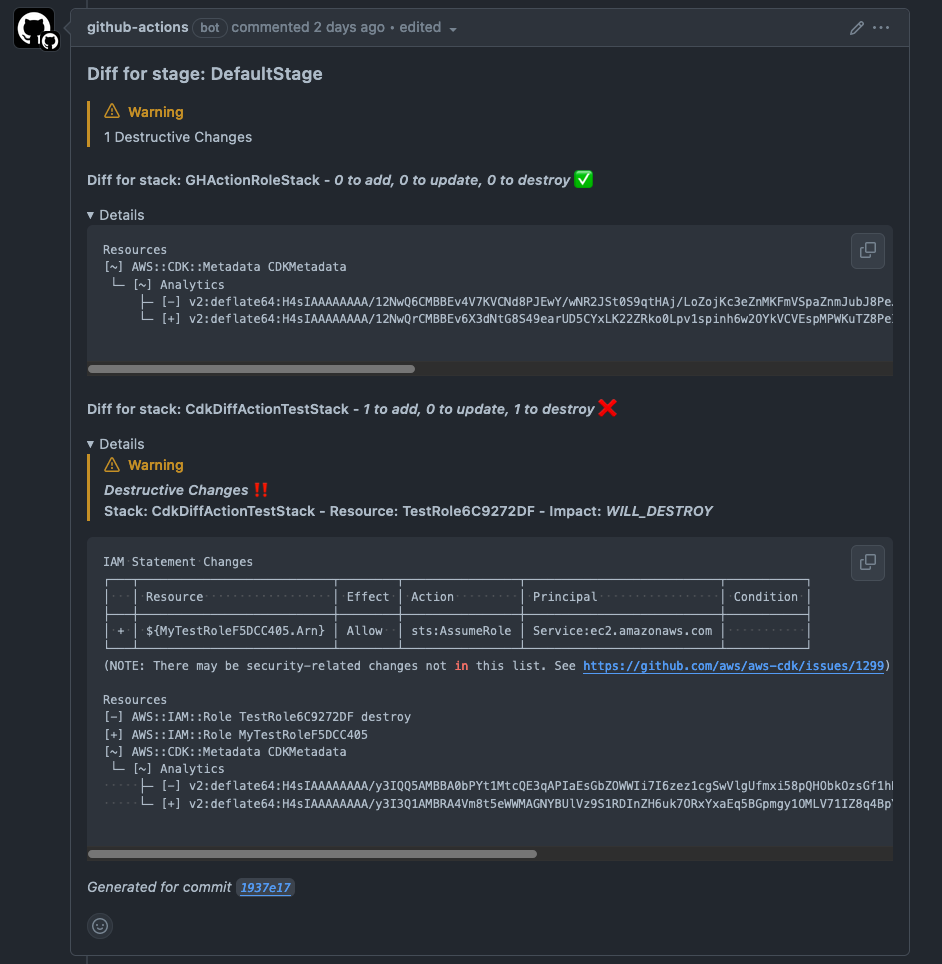
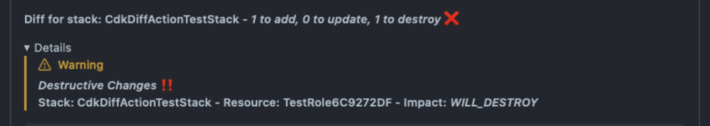

Announcing the [cdk-diff-action](https://github.com/corymhall/cdk-diff-action)
GitHub action 🚀! When you create a PR, this GitHub action will post the
CloudFormation diff for all stacks in your CDK application onto PR comments.

## ✨ Features

- 💬 Create a single comment per CDK stage
- ♻️ Updates the same comment on each commit, reducing clutter
- ‼️ Calls out any destructive changes to resources
- ❌ Fail workflow if there are destructive changes
- 🧵 Summary of stack changes with expandable details
- 🙈 Allow destructive changes for certain resource types



## Using the action

Below is an example job configuration that provides the basics.

1. You need to `synth` the CDK application so the diff action has access to the
   `cdk.out` directory.
2. You need to authenticate to AWS so that the diff action can read the existing
   template.

For authentication I recommend using the same method as
[cdk-pipelines-github](https://github.com/cdklabs/cdk-pipelines-github). If you
are not using `cdk-pipelines-github`, you should still reference their
[credentials
guide](https://github.com/cdklabs/cdk-pipelines-github#aws-credentials).

```go
cdkpipelinesgithub.NewGitHubActionRole(this, jsii.String("github-action-role"), &GitHubActionRoleProps{
    Repos: []*string{
        jsii.String("myUser/myRepo"),
    },
})
```

This will create an IAM role that is able to assume all of the CDK bootstrap
roles. The `cdk-diff-action` performs diffs for every stack in your application,
which can exist in many different AWS accounts. It does this by using the
credentials you configure to assume the CDK bootstrap lookup role in each
account (which is configured with read-only access). If you are not using the
CDK bootstrap roles, then you will have to create your own authentication
strategy.

```yml
name: diff
on:
  pull_request:
    branches:
      - main
jobs:
  Synth:
    name: Synthesize
    permissions:
      contents: read
      pull-requests: write
      id-token: write
    runs-on: ubuntu-latest
    steps:
      - name: Checkout
        uses: actions/checkout@v4
      - name: Setup Node
        uses: actions/setup-node@v3
        with:
          node-version: 20
      - name: Install dependencies
        run: yarn install --frozen-lockfile
      - name: Synth
        run: npx cdk synth
      - name: Authenticate Via OIDC Role
        uses: aws-actions/configure-aws-credentials@v4
        with:
          aws-region: us-east-2
          role-duration-seconds: 1800
          role-skip-session-tagging: true
          role-to-assume: arn:aws:iam::1234567891012:role/cdk_github_actions
          role-session-name: github
      - name: Diff
        uses: corymhall/cdk-diff-action@v1
        with:
          githubToken: ${{ secrets.GITHUB_TOKEN }}
```

This action also supports semver versioning (more on that later).

For example, to get the latest `v1.x.x` version.

```yml
uses: corymhall/cdk-diff-action@v1
```

Or to get the latest `v1.1.x` version.

```yml
uses: corymhall/cdk-diff-action@v1.1
```

## Motivation

I created this GitHub action because I couldn't find an existing GitHub action
that did all the things I wanted. Yes, I wanted a way to see the stack diff as
part of a PR, but I also wanted to call out potentially dangerous changes. I've
seen it happen in the past where destructive changes were just missed in a PR
review.

## Building the action

I'm now going to get a little into the weeds on how I built the plugin and some
of the tools that I used.

### Tools used

#### [Projen](https://github.com/projen/projen) & [projen-github-action-typescript](https://github.com/projen/projen-github-action-typescript)

If you are familiar with the CDK chances are that you are familiar with projen,
and if not, you can think of projen as CDK for projects. Projen has a bunch of
built-in project types, but it also allow you to create a project from a 3rd
party library. The [projen-github-action-typescript](https://github.com/projen/projen-github-action-typescript)
library creates a GitHub actions project.

#### [@aws-cdk/cloudformation-diff](https://www.npmjs.com/package/@aws-cdk/cloudformation-diff)

This is the library that powers the AWS CDK CLI's `cdk diff` command. It
provides functionality for performing the diff as well as formatting the diff to
be printed. This is the library that made this action possible. By plugging into
the `cloudformation-diff` library directly I can get detailed, resource level
information on the diff. Some things I'm using this library for:

- Counting created, updated, deleted resources
- Determining resource change impact (destroy, replace, orphan, etc)
- Determining which fields have changes.
  - This allows for things like ignoring certain changes (e.g. Lambda Code
    changes)

### Challenges

I wanted to talk through some of the random challenges I ran into while building
this action.

#### mockfs and node v20

As I started writing tests for `cdk-diff-action` I used the awesome
[mock-fs](https://github.com/tschaub/mock-fs) library which allows you to create
a mock filesystem. This allowed me to mock out the relevant `cdk.out` files that
are used by the action. Sometime after starting to write the tests, I switched
my system node version to node 20 which had recently become the LTS version. All
of a sudden I started getting errors like:

```shell
Error: ENOENT: no such file or directory, open 'file'
```

I went back over the tests and the `mock-fs` documentation, but couldn't figure
out what I was doing wrong, especially since the tests used to work! Finally
after a lot of googling I came across [this issue](https://github.com/tschaub/mock-fs/issues/377),
which indicates mockfs doesn't currently support nodev20! The suggested
workaround was to change this

```
fs.readFileSync(foo, 'utf-8')
```
to this

```
with fs.readFileSync(foo).toString('utf-8')
```

I went through and updated my code, but still received the error message! After
some debugging I realized that the error was coming from my use of the
`@aws-cdk/cloud-assembly-schema` library to load the Cloud Assembly manifest
file. Since that library has not been updated to support node20 I couldn't find
a way around the issue and ultimately had to switch back to node18.

#### semver tags

When I first published version `v1.0.0` of the plugin I included instructions in
the README to use version `@v1`. I just assumed that GitHub actions supported
semantic versioning because that is how I always saw other actions specify their
versions. Soon after, I received my [first
issue](https://github.com/corymhall/cdk-diff-action/issues/9) saying that GitHub
actions couldn't find `@v1`. After doing some research, turns out that GitHub actions
[doesn't actually support semantic versioning](https://devopsjournal.io/blog/2022/10/19/How-GitHub-Actions-versioning-works)!
Other plugins make semver versioning possible by utilizing things like long
lived version branches.

For a while I tried going this route with a `v1-beta` branch, but that quickly
became a pain to manage. I would push changes to that branch and forget to sync
them to `main`, `main` would get dependency updates that I would have to sync
with `v1-beta`, etc. I already had automatic releases via `projen` which would
publish a new GitHub release for every commit to `main`. I just needed to find a
way to have it also automatically create semantic versioned tags. If the
new version being published was `v1.1.2` I would also need to update the `v1`
and the `v1.1` tags to point to the latest commit.

For my first attempt, I created a [new script](https://github.com/corymhall/cdk-diff-action/blob/04308d015d55f93fdd3e0516855b8cbc6f1e7b0f/projenrc/release-version.ts#L45-L49)
that would create the new release (for e.g. `v1.1.2`) and then would force
update the `v1` and `v1.1` tags. After a lot of trial and error I finally got
stuck on a git error when trying to push the tags.

```shell
Error: Command failed: git push origin --tags
fatal: could not read Username for 'https://github.com': No such device or address
```

I came across [this stackoverflow answer](https://stackoverflow.com/a/71984173)
that indicated it was an auth issue. Looking at the code for
[actions/checkout](https://github.com/actions/checkout) they do some pretty
complicated stuff to handle authenticating git to GitHub. I started to copy some
of the logic over and then had the thought, why does it fail when I try and push
the tags, but it doesn't fail when I create the release? Shouldn't the
authentication required be the same? Of course! I was using the `git` cli to try
and push the tags, but was using the [gh cli](https://cli.github.com/) to create the
release! As long as you have the `GITHUB_TOKEN` environment variable set, `gh`
handles the auth setup for you. You can use the `gh` cli to make [any
authenticated api call](https://cli.github.com/manual/gh_api) to GitHub, all I
needed to do was find the right API calls. After a little more trial an error I
finally ended up with a [working solution](https://github.com/corymhall/cdk-diff-action/blob/main/projenrc/release-version.ts)!
I plan on running with this for a while to work out any bugs and then I'll try
and contribute it to the [projen-github-action-typescript](https://github.com/projen/projen-github-action-typescript) library.

#### formatting

Those of you with a great attention to detail might notice that the image of the
diff at the top of this blog (and the one on the repo README) doesn't quite
match what you see today. If there are destructive changes for a particular
stage, it shows a `Warning` alert when you expand the `details` drop down.



This no longer works! After I took the screenshot, I noticed that the alert
was no longer showing as a nice formatted `alert`.
Turns out [GitHub eliminated nesting alerts](https://github.com/orgs/community/discussions/16925#discussioncomment-7571187)
as part of a bug "fix" 😦.
